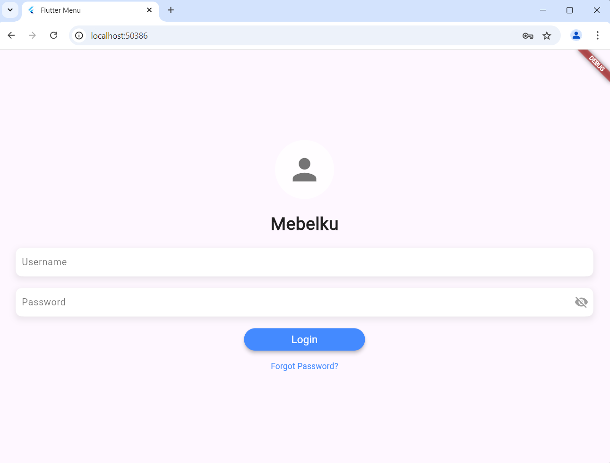
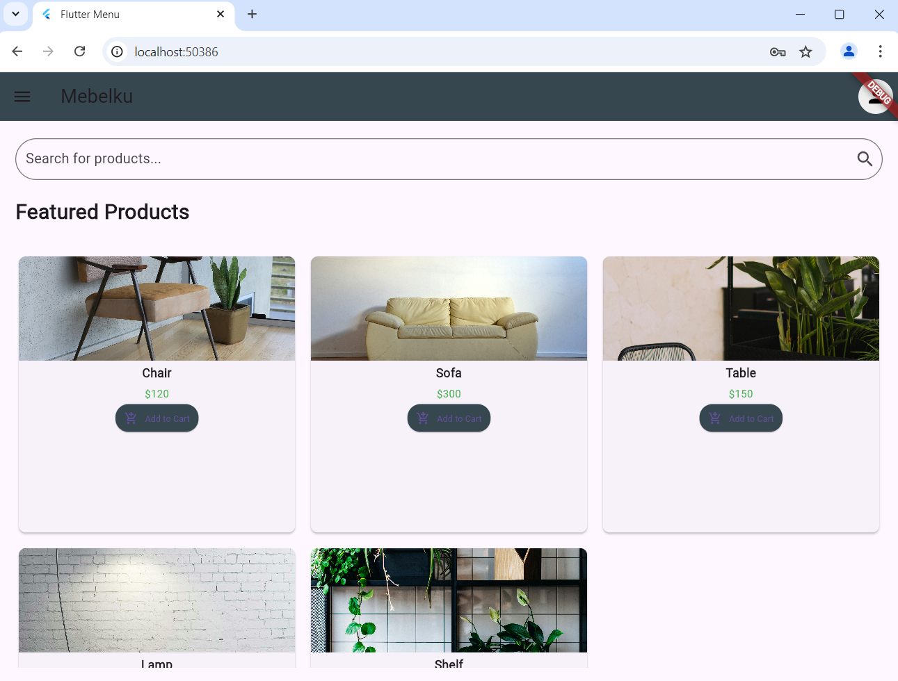

#PENJELASAN CODE 

main() Function: Fungsi ini merupakan titik awal eksekusi aplikasi. Di sini, runApp(const MyApp()) dijalankan untuk memulai aplikasi Flutter dengan widget MyApp.

MyApp Class: MyApp adalah widget stateless yang menjadi kerangka utama aplikasi. Dalam widget ini, MaterialApp digunakan untuk mengonfigurasi aplikasi.

MaterialApp:

    title: Menentukan judul aplikasi, yang digunakan di beberapa platform seperti Android saat menampilkan aplikasi di task manager.
    initialRoute: Menentukan rute awal yang ditampilkan saat aplikasi pertama kali dijalankan. Dalam hal ini, rute awal diarahkan ke halaman login (/).
    routes: Menyediakan daftar rute (URL) yang terkait dengan widget tertentu. Ada tiga rute yang didefinisikan:
        '/': Menampilkan LoginPage, yaitu halaman login sebagai halaman pertama saat aplikasi dibuka.
        '/home': Menampilkan HomePage, yang kemungkinan besar adalah halaman utama setelah pengguna login.
        '/about': Menampilkan AboutPage, halaman informasi tentang aplikasi.

Navigasi: Aplikasi ini menggunakan rute untuk berpindah halaman. Misalnya, setelah login berhasil, aplikasi dapat menavigasi dari LoginPage ke HomePage dengan cara memanggil Navigator.pushReplacementNamed(context, '/home').

import 'package:flutter/material.dart';
import 'package:shared_preferences/shared_preferences.dart';
import 'dart:ui';
import '/router_flutter/home_page.dart';

class LoginPage extends StatefulWidget {
  const LoginPage({super.key});

  @override
  _LoginPageState createState() => _LoginPageState();
}

class _LoginPageState extends State<LoginPage> with SingleTickerProviderStateMixin {
  final TextEditingController _usernameController = TextEditingController();
  final TextEditingController _passwordController = TextEditingController();
  final _formKey = GlobalKey<FormState>();
  bool _isLoading = false;
  bool _obscureText = true;

  late AnimationController _animationController;
  late Animation<double> _buttonAnimation;

  @override
  void initState() {
    super.initState();
    _animationController = AnimationController(
      vsync: this,
      duration: const Duration(milliseconds: 500),
    );

    _buttonAnimation = Tween<double>(begin: 1.0, end: 1.05).animate(CurvedAnimation(
      parent: _animationController,
      curve: Curves.easeInOut,
    ))..addStatusListener((status) {
      if (status == AnimationStatus.completed) {
        _animationController.reverse();
      }
    });
  }

  @override
  void dispose() {
    _animationController.dispose();
    _usernameController.dispose();
    _passwordController.dispose();
    super.dispose();
  }

  void _saveUsername() async {
    SharedPreferences prefs = await SharedPreferences.getInstance();
    prefs.setString('username', _usernameController.text);
  }

  Widget _showInput(TextEditingController controller, String label, bool isPassword) {
    return Padding(
      padding: const EdgeInsets.symmetric(vertical: 10.0), // Added padding for cleaner spacing
      child: Container(
        decoration: BoxDecoration(
          color: Colors.white,
          borderRadius: BorderRadius.circular(10.0),
          boxShadow: [
            BoxShadow(
              color: Colors.grey.withOpacity(0.2), // Light shadow for modern effect
              spreadRadius: 2,
              blurRadius: 8,
              offset: const Offset(0, 4), // changes position of shadow
            ),
          ],
        ),
        child: TextFormField(
          controller: controller,
          obscureText: isPassword ? _obscureText : false,
          decoration: InputDecoration(
            labelText: label,
            filled: true,
            fillColor: Colors.white,
            contentPadding: const EdgeInsets.symmetric(horizontal: 10, vertical: 8), // Padding for input content
            labelStyle: const TextStyle(color: Colors.black54, fontSize: 16),
            enabledBorder: OutlineInputBorder(
              borderRadius: BorderRadius.circular(15.0),
              borderSide: BorderSide.none,
            ),
            focusedBorder: OutlineInputBorder(
              borderRadius: BorderRadius.circular(15.0),
              borderSide: BorderSide.none,
            ),
            suffixIcon: isPassword
                ? IconButton(
              icon: Icon(_obscureText ? Icons.visibility_off : Icons.visibility,
                  color: Colors.grey),
              onPressed: () {
                setState(() {
                  _obscureText = !_obscureText;
                });
              },
            )
                : null,
          ),
          validator: (value) {
            if (value == null || value.isEmpty) {
              return '$label is required';
            }
            return null;
          },
          style: const TextStyle(color: Colors.black87),
        ),
      ),
    );
  }

  Future<void> _login() async {
    if (_formKey.currentState!.validate()) {
      setState(() {
        _isLoading = true;
      });

      await Future.delayed(const Duration(seconds: 2)); // Simulasi proses login

      if (_usernameController.text == 'admin' && _passwordController.text == 'admin') {
        _saveUsername();
        _showSnackbar('Login Successful');
        Navigator.pushReplacement(
          context,
          MaterialPageRoute(builder: (context) => const HomePage()),
        );
      } else {
        _showSnackbar('Incorrect Username or Password');
      }

      setState(() {
        _isLoading = false;
      });
    }
  }

  void _showSnackbar(String message) {
    final snackBar = SnackBar(
      content: Text(message),
      backgroundColor: Colors.blueAccent,
      shape: RoundedRectangleBorder(
        borderRadius: BorderRadius.circular(12),
      ),
      behavior: SnackBarBehavior.floating,
      margin: const EdgeInsets.all(16),
    );
    ScaffoldMessenger.of(context).showSnackBar(snackBar);
  }

  @override
  Widget build(BuildContext context) {
    return Scaffold(
      body: Stack(
        fit: StackFit.expand,
        children: [
          // Background with Image
          Container(
            decoration: const BoxDecoration(
              image: DecorationImage(
                image: AssetImage('assets/background.jpg'),
                fit: BoxFit.cover,
                colorFilter: ColorFilter.mode(
                    Colors.white60, BlendMode.softLight),
              ),
            ),
          ),
          // Form
          Center(
            child: SingleChildScrollView(
              child: Padding(
                padding: const EdgeInsets.symmetric(horizontal: 30.0),
                child: Form(
                  key: _formKey,
                  child: Column(
                    mainAxisAlignment: MainAxisAlignment.center,
                    children: [
                      // Logo placeholder
                      const CircleAvatar(
                        radius: 50,
                        backgroundColor: Colors.white70,
                        child: Icon(Icons.person, size: 60, color: Colors.black54),
                      ),
                      const SizedBox(height: 20),
                      // Title Text
                      const Text(
                        'Mebelku',
                        style: TextStyle(
                          color: Colors.black87,
                          fontSize: 30,
                          fontWeight: FontWeight.bold,
                        ),
                      ),
                      const SizedBox(height: 10),
                      // Input fields
                      _showInput(_usernameController, 'Username', false),
                      _showInput(_passwordController, 'Password', true),
                      const SizedBox(height: 10),
                      // Login Button
                      ScaleTransition(
                        scale: _buttonAnimation,
                        child: _isLoading
                            ? const CircularProgressIndicator(
                          valueColor: AlwaysStoppedAnimation(Colors.blueAccent),
                        )
                            : ElevatedButton(
                          style: ElevatedButton.styleFrom(
                            padding: const EdgeInsets.symmetric(horizontal: 80, vertical: 14),
                            backgroundColor: Colors.blueAccent,
                            shape: RoundedRectangleBorder(
                              borderRadius: BorderRadius.circular(30),
                            ),
                            elevation: 5,
                          ),
                          child: const Text('Login',
                              style: TextStyle(fontSize: 18, color: Colors.white)),
                          onPressed: () {
                            _animationController.forward();
                            _login();
                          },
                        ),
                      ),
                      const SizedBox(height: 10),
                      // Forgot Password Text
                      TextButton(
                        onPressed: () {
                          // Handle forgot password logic
                        },
                        child: const Text(
                          'Forgot Password?',
                          style: TextStyle(color: Colors.blueAccent),
                        ),
                      ),
                    ],
                  ),
                ),
              ),
            ),
          ),
        ],
      ),
    );
  }
}

Widget LoginPage:

    LoginPage adalah widget stateful yang merepresentasikan layar login.
    Di dalamnya terdapat kolom input untuk memasukkan username dan password, sebuah tombol untuk login, serta beberapa animasi UI untuk meningkatkan pengalaman pengguna.

Manajemen State (_LoginPageState):

    TextEditingController (_usernameController dan _passwordController) digunakan untuk mengontrol input dari kolom username dan password.
    GlobalKey (_formKey) digunakan untuk memvalidasi form input.

Animasi:

    AnimationController (_animationController) digunakan untuk mengatur animasi skala pada tombol login. Ketika tombol ditekan, animasi skala dijalankan untuk memperbesar tombol sedikit sebelum kembali ke ukuran normal. Hal ini memberikan efek visual dinamis saat pengguna menekan tombol.

Fungsi _saveUsername:

    Fungsi ini menyimpan username yang diinput pengguna ke dalam SharedPreferences, sehingga data tersebut dapat digunakan di masa mendatang, misalnya untuk mengingat pengguna yang telah login.

Fungsi _showInput:

    Fungsi ini menampilkan widget TextFormField yang digunakan untuk input username dan password. Jika input adalah password, teks akan ditampilkan dalam bentuk tersembunyi (menggunakan ikon mata untuk menampilkan/menyembunyikan). Fungsi ini juga menerapkan validator untuk memastikan input tidak kosong.

Fungsi _login:

    Fungsi ini digunakan untuk memvalidasi input pengguna. Jika username dan password yang diinput sesuai (di sini validasi sederhana yaitu admin untuk username dan password), maka login dianggap berhasil dan pengguna akan diarahkan ke halaman HomePage.
    Jika login gagal, snackbar akan ditampilkan dengan pesan error.
    Fungsi ini juga menggunakan Future.delayed untuk mensimulasikan proses login yang tertunda selama 2 detik, misalnya saat melakukan request ke server.

Snackbar:

    Snackbar digunakan untuk menampilkan pesan kepada pengguna, misalnya ketika login berhasil atau gagal. Snackbar muncul di bagian bawah layar dan memiliki efek visual mengambang.

Tampilan Layar:

    Tampilan login menggunakan Stack yang diisi dengan latar belakang gambar dan form login. Di bagian form, ada logo placeholder berupa lingkaran dengan ikon pengguna, input field untuk username dan password, serta tombol login yang terhubung dengan animasi.
    Pengguna juga dapat menekan Forgot Password jika lupa kata sandi, meskipun fungsinya belum diimplementasikan.
import 'package:flutter/material.dart';
import 'package:shared_preferences/shared_preferences.dart';
import 'dart:ui';
import '/router_flutter/home_page.dart';

class LoginPage extends StatefulWidget {
  const LoginPage({super.key});

  @override
  _LoginPageState createState() => _LoginPageState();
}

class _LoginPageState extends State<LoginPage> with SingleTickerProviderStateMixin {
  final TextEditingController _usernameController = TextEditingController();
  final TextEditingController _passwordController = TextEditingController();
  final _formKey = GlobalKey<FormState>();
  bool _isLoading = false;
  bool _obscureText = true;

  late AnimationController _animationController;
  late Animation<double> _buttonAnimation;

  @override
  void initState() {
    super.initState();
    _animationController = AnimationController(
      vsync: this,
      duration: const Duration(milliseconds: 500),
    );

    _buttonAnimation = Tween<double>(begin: 1.0, end: 1.05).animate(CurvedAnimation(
      parent: _animationController,
      curve: Curves.easeInOut,
    ))..addStatusListener((status) {
      if (status == AnimationStatus.completed) {
        _animationController.reverse();
      }
    });
  }

  @override
  void dispose() {
    _animationController.dispose();
    _usernameController.dispose();
    _passwordController.dispose();
    super.dispose();
  }

  void _saveUsername() async {
    SharedPreferences prefs = await SharedPreferences.getInstance();
    prefs.setString('username', _usernameController.text);
  }

  Widget _showInput(TextEditingController controller, String label, bool isPassword) {
    return Padding(
      padding: const EdgeInsets.symmetric(vertical: 10.0), // Added padding for cleaner spacing
      child: Container(
        decoration: BoxDecoration(
          color: Colors.white,
          borderRadius: BorderRadius.circular(10.0),
          boxShadow: [
            BoxShadow(
              color: Colors.grey.withOpacity(0.2), // Light shadow for modern effect
              spreadRadius: 2,
              blurRadius: 8,
              offset: const Offset(0, 4), // changes position of shadow
            ),
          ],
        ),
        child: TextFormField(
          controller: controller,
          obscureText: isPassword ? _obscureText : false,
          decoration: InputDecoration(
            labelText: label,
            filled: true,
            fillColor: Colors.white,
            contentPadding: const EdgeInsets.symmetric(horizontal: 10, vertical: 8), // Padding for input content
            labelStyle: const TextStyle(color: Colors.black54, fontSize: 16),
            enabledBorder: OutlineInputBorder(
              borderRadius: BorderRadius.circular(15.0),
              borderSide: BorderSide.none,
            ),
            focusedBorder: OutlineInputBorder(
              borderRadius: BorderRadius.circular(15.0),
              borderSide: BorderSide.none,
            ),
            suffixIcon: isPassword
                ? IconButton(
              icon: Icon(_obscureText ? Icons.visibility_off : Icons.visibility,
                  color: Colors.grey),
              onPressed: () {
                setState(() {
                  _obscureText = !_obscureText;
                });
              },
            )
                : null,
          ),
          validator: (value) {
            if (value == null || value.isEmpty) {
              return '$label is required';
            }
            return null;
          },
          style: const TextStyle(color: Colors.black87),
        ),
      ),
    );
  }

  Future<void> _login() async {
    if (_formKey.currentState!.validate()) {
      setState(() {
        _isLoading = true;
      });

      await Future.delayed(const Duration(seconds: 2)); // Simulasi proses login

      if (_usernameController.text == 'admin' && _passwordController.text == 'admin') {
        _saveUsername();
        _showSnackbar('Login Successful');
        Navigator.pushReplacement(
          context,
          MaterialPageRoute(builder: (context) => const HomePage()),
        );
      } else {
        _showSnackbar('Incorrect Username or Password');
      }

      setState(() {
        _isLoading = false;
      });
    }
  }

  void _showSnackbar(String message) {
    final snackBar = SnackBar(
      content: Text(message),
      backgroundColor: Colors.blueAccent,
      shape: RoundedRectangleBorder(
        borderRadius: BorderRadius.circular(12),
      ),
      behavior: SnackBarBehavior.floating,
      margin: const EdgeInsets.all(16),
    );
    ScaffoldMessenger.of(context).showSnackBar(snackBar);
  }

  @override
  Widget build(BuildContext context) {
    return Scaffold(
      body: Stack(
        fit: StackFit.expand,
        children: [
          // Background with Image
          Container(
            decoration: const BoxDecoration(
              image: DecorationImage(
                image: AssetImage('assets/background.jpg'),
                fit: BoxFit.cover,
                colorFilter: ColorFilter.mode(
                    Colors.white60, BlendMode.softLight),
              ),
            ),
          ),
          // Form
          Center(
            child: SingleChildScrollView(
              child: Padding(
                padding: const EdgeInsets.symmetric(horizontal: 30.0),
                child: Form(
                  key: _formKey,
                  child: Column(
                    mainAxisAlignment: MainAxisAlignment.center,
                    children: [
                      // Logo placeholder
                      const CircleAvatar(
                        radius: 50,
                        backgroundColor: Colors.white70,
                        child: Icon(Icons.person, size: 60, color: Colors.black54),
                      ),
                      const SizedBox(height: 20),
                      // Title Text
                      const Text(
                        'Mebelku',
                        style: TextStyle(
                          color: Colors.black87,
                          fontSize: 30,
                          fontWeight: FontWeight.bold,
                        ),
                      ),
                      const SizedBox(height: 10),
                      // Input fields
                      _showInput(_usernameController, 'Username', false),
                      _showInput(_passwordController, 'Password', true),
                      const SizedBox(height: 10),
                      // Login Button
                      ScaleTransition(
                        scale: _buttonAnimation,
                        child: _isLoading
                            ? const CircularProgressIndicator(
                          valueColor: AlwaysStoppedAnimation(Colors.blueAccent),
                        )
                            : ElevatedButton(
                          style: ElevatedButton.styleFrom(
                            padding: const EdgeInsets.symmetric(horizontal: 80, vertical: 14),
                            backgroundColor: Colors.blueAccent,
                            shape: RoundedRectangleBorder(
                              borderRadius: BorderRadius.circular(30),
                            ),
                            elevation: 5,
                          ),
                          child: const Text('Login',
                              style: TextStyle(fontSize: 18, color: Colors.white)),
                          onPressed: () {
                            _animationController.forward();
                            _login();
                          },
                        ),
                      ),
                      const SizedBox(height: 10),
                      // Forgot Password Text
                      TextButton(
                        onPressed: () {
                          // Handle forgot password logic
                        },
                        child: const Text(
                          'Forgot Password?',
                          style: TextStyle(color: Colors.blueAccent),
                        ),
                      ),
                    ],
                  ),
                ),
              ),
            ),
          ),
        ],
      ),
    );
  }
}

Widget HomePage:

    HomePage adalah widget stateful yang digunakan untuk menampilkan halaman utama aplikasi. Di sini, terdapat AppBar dengan judul "Mebelku" dan drawer yang berisi menu samping (SideMenu).
    Pengguna juga bisa melihat daftar produk dalam bentuk GridView, serta melakukan pencarian produk melalui Search Bar.

State Management (_HomePageState):

    Variabel namauser digunakan untuk menyimpan nama pengguna yang diambil dari SharedPreferences.
    Fungsi _loadUsername() berfungsi untuk mengambil username yang disimpan di SharedPreferences saat pengguna login, dan menampilkan username tersebut di halaman utama.

Daftar Produk:

    Sebagai contoh, kode ini menyiapkan daftar produk berupa list berisi beberapa produk (kursi, sofa, meja, lampu, dan rak) yang terdiri dari nama, gambar, dan harga.

AppBar dan Avatar Pengguna:

    AppBar memiliki judul "Mebelku" dengan latar belakang berwarna abu-abu biru tua (Colors.blueGrey[800]).
    Di sebelah kanan AppBar, terdapat CircleAvatar sebagai placeholder untuk ikon pengguna.

Search Bar:

    Search Bar berada di bagian atas halaman yang memungkinkan pengguna mencari produk. Search bar ini dilengkapi dengan TextField dan ikon pencarian di sebelah kanannya.

GridView Produk:

    Produk ditampilkan dalam bentuk GridView dengan 3 kolom per baris, menggunakan SliverGridDelegateWithFixedCrossAxisCount.
    Setiap item produk ditampilkan dalam bentuk Card, dengan gambar produk di bagian atas dan detail nama serta harga di bagian bawah.
    Tombol Add to Cart disediakan di setiap produk untuk memungkinkan pengguna menambahkan produk ke keranjang belanja.

Desain Card Produk:

    Kartu produk dirancang dengan sudut yang membulat (menggunakan RoundedRectangleBorder), serta gambar produk berada di dalam ClipRRect untuk memberikan efek sudut bulat di bagian atas kartu.
    Di bawah gambar, terdapat nama produk, harga, dan tombol "Add to Cart". Ukuran teks dan padding diatur agar lebih ringkas dan tampak rapi.

Fungsi untuk Detail dan Keranjang:

    Ketika pengguna menekan gambar produk, kode diatur untuk menampilkan detail produk (walaupun fungsinya belum diimplementasikan).
    Tombol Add to Cart juga disiapkan untuk menambahkan produk ke keranjang belanja, meskipun fungsinya juga belum diimplementasikan.
import 'package:flutter/material.dart';
import 'package:shared_preferences/shared_preferences.dart';
import '/router_flutter/side_menu.dart';

class HomePage extends StatefulWidget {
  const HomePage({Key? key}) : super(key: key);

  @override
  _HomePageState createState() => _HomePageState();
}

class _HomePageState extends State<HomePage> {
  var namauser;

  // Simulasi data produk untuk tampilan grid
  final List<Map<String, String>> products = [
    {"name": "Chair", "image": "chair.jpg", "price": "\$120"},
    {"name": "Sofa", "image": "sofa.jpg", "price": "\$300"},
    {"name": "Table", "image": "table.jpg", "price": "\$150"},
    {"name": "Lamp", "image": "lamp.jpg", "price": "\$80"},
    {"name": "Shelf", "image": "shelf.jpg", "price": "\$200"},
  ];

  @override
  void initState() {
    super.initState();
    _loadUsername();
  }

  void _loadUsername() async {
    SharedPreferences prefs = await SharedPreferences.getInstance();
    namauser = prefs.getString('username');
    setState(() {});
  }

  @override
  Widget build(BuildContext context) {
    return Scaffold(
      appBar: AppBar(
        title: const Text('Mebelku'),
        backgroundColor: Colors.blueGrey[800],
        actions: [
          Padding(
            padding: const EdgeInsets.all(8.0),
            child: CircleAvatar(
              backgroundColor: Colors.grey[200],
              child: const Icon(Icons.person, color: Colors.black),
            ),
          ),
        ],
      ),
      drawer: const Sidemenu(),
      body: Padding(
        padding: const EdgeInsets.all(20.0),
        child: Column(
          crossAxisAlignment: CrossAxisAlignment.start,
          children: [
            // Search Bar
            TextField(
              decoration: InputDecoration(
                hintText: 'Search for products...',
                border: OutlineInputBorder(
                  borderRadius: BorderRadius.circular(30),
                  borderSide: BorderSide(color: Colors.grey),
                ),
                suffixIcon: Icon(Icons.search),
              ),
            ),
            const SizedBox(height: 20),

            // Header "Featured Products"
            const Text(
              'Featured Products',
              style: TextStyle(
                fontSize: 24,
                fontWeight: FontWeight.bold,
              ),
            ),
            const SizedBox(height: 20),

            // GridView untuk menampilkan produk
            Expanded(
              child: GridView.builder(
                padding: const EdgeInsets.symmetric(vertical: 10),
                itemCount: products.length,
                gridDelegate: const SliverGridDelegateWithFixedCrossAxisCount(
                  crossAxisCount: 3, // Tetap 2 kolom
                  mainAxisSpacing: 10,
                  crossAxisSpacing: 10,
                  childAspectRatio: 1, // Aspect ratio lebih besar untuk membuat kartu lebih kecil
                ),
                itemBuilder: (context, index) {
                  return GestureDetector(
                    onTap: () {
                      // Fungsi untuk detail produk
                    },
                    child: Card(
                      elevation: 2,
                      shape: RoundedRectangleBorder(
                        borderRadius: BorderRadius.circular(8), // Sudut kartu sedikit lebih kecil
                      ),
                      child: Column(
                        crossAxisAlignment: CrossAxisAlignment.center,
                        children: [
                          // Gambar Produk dengan tinggi lebih kecil
                          ClipRRect(
                            borderRadius: const BorderRadius.only(
                              topLeft: Radius.circular(8),
                              topRight: Radius.circular(8),
                            ),
                            child: Container(
                              height: 120, // Tinggi gambar dikurangi agar kartu lebih kecil
                              width: double.infinity, // Lebar penuh
                              child: Image.asset(
                                products[index]["image"]!,
                                fit: BoxFit.cover, // Gambar tetap memenuhi container
                              ),
                            ),
                          ),
                          Padding(
                            padding: const EdgeInsets.symmetric(horizontal: 6.0, vertical: 4.0), // Padding lebih kecil
                            child: Column(
                              crossAxisAlignment: CrossAxisAlignment.center,
                              children: [
                                // Nama Produk
                                Text(
                                  products[index]["name"]!,
                                  style: const TextStyle(
                                    fontSize: 14, // Ukuran font lebih kecil
                                    fontWeight: FontWeight.bold,
                                  ),
                                  textAlign: TextAlign.center,
                                ),
                                const SizedBox(height: 5),
                                // Harga Produk
                                Text(
                                  products[index]["price"]!,
                                  style: const TextStyle(
                                    fontSize: 12, // Ukuran font lebih kecil
                                    color: Colors.green,
                                  ),
                                  textAlign: TextAlign.center,
                                ),
                                const SizedBox(height: 4),
                                // Tombol Add to Cart
                                ElevatedButton.icon(
                                  style: ElevatedButton.styleFrom(
                                    backgroundColor: Colors.blueGrey[800],
                                    padding: const EdgeInsets.symmetric(horizontal: 10, vertical: 6), // Padding lebih kecil
                                    shape: RoundedRectangleBorder(
                                      borderRadius: BorderRadius.circular(15), // Ukuran tombol lebih kecil
                                    ),
                                  ),
                                  onPressed: () {
                                    // Fungsi untuk menambahkan ke keranjang
                                  },
                                  icon: const Icon(Icons.add_shopping_cart, size: 16), // Ikon lebih kecil
                                  label: const Text('Add to Cart', style: TextStyle(fontSize: 10)), // Label lebih kecil
                                ),
                              ],
                            ),
                          ),
                        ],
                      ),
                    ),
                  );
                },
              ),
            )
          ],
        ),
      ),
    );
  }
}

AboutPage Widget:

    AboutPage merupakan widget stateless yang menampilkan halaman "Tentang MebelKu" yang berisi informasi mengenai perusahaan, fitur, dan layanan yang ditawarkan.
    Halaman ini dilengkapi dengan AppBar yang memiliki judul "Tentang MebelKu" dan warna latar belakang abu-abu biru (Colors.blueGrey[800]).
    Terdapat juga drawer (menu samping) yang diambil dari widget Sidemenu.

Bagian Gambar Header:

    Pada bagian atas halaman, terdapat Container dengan gambar ilustratif (mabel_banner.jpg) yang digunakan sebagai header.
    Di dalam header ini, terdapat dua Text yang menampilkan judul "Selamat Datang di MebelKu!" dan deskripsi singkat "Furniture Berkualitas untuk Hunian Elegan Anda". Teks ini memiliki gaya teks yang besar dan tebal (bold) agar terlihat menarik.

Bagian Deskripsi:

    Setelah header, terdapat bagian deskripsi yang memberikan informasi lebih lanjut tentang MebelKu, seperti visi dan misi perusahaan dalam menyediakan furniture berkualitas tinggi.
    Deskripsi dibagi menjadi dua bagian utama:
        Tentang MebelKu: Menjelaskan bahwa MebelKu fokus pada kenyamanan, kemewahan, dan keahlian dalam setiap produknya.
        Nilai dari MebelKu: MebelKu percaya bahwa furniture bukan hanya berfungsi secara praktis, tetapi juga merupakan bagian dari cerita dalam sebuah rumah.

Fitur Utama:

    Di bagian bawah deskripsi, ada tiga fitur utama MebelKu yang ditampilkan dalam bentuk tiga FeatureCard:
        Kualitas Premium: Menekankan bahwa produk MebelKu dibuat dengan bahan berkualitas tinggi dan pengerjaan tangan profesional.
        Desain Unik: Menyebutkan bahwa produk MebelKu didesain dengan cermat untuk menyatu dengan gaya hidup pelanggan.
        Layanan Terbaik: Menunjukkan bahwa kepuasan pelanggan adalah prioritas utama perusahaan.
    Fitur ini ditampilkan dalam bentuk Row dengan tiga elemen yang disejajarkan secara horizontal menggunakan mainAxisAlignment.spaceAround.

FeatureCard Widget:

    FeatureCard adalah widget custom yang digunakan untuk menampilkan ikon, judul, dan deskripsi fitur secara lebih rapi.
    Masing-masing FeatureCard menampilkan:
        CircleAvatar: Sebagai ikon berbentuk lingkaran dengan warna latar belakang coklat muda, di dalamnya terdapat ikon yang melambangkan fitur tertentu (seperti bintang untuk kualitas premium).
        Text: Judul fitur ditampilkan dengan ukuran font yang besar dan tebal, dan deskripsi fitur diberikan di bawahnya dalam ukuran font yang lebih kecil.
    CircleAvatar dan teks diberi SizedBox untuk memberikan spasi antar elemen agar tampil lebih rapi.
  import 'package:flutter/material.dart';
import 'package:pertemuan3/router_flutter/side_menu.dart';

class AboutPage extends StatelessWidget {
  const AboutPage({super.key});

  @override
  Widget build(BuildContext context) {
    return Scaffold(
      appBar: AppBar(
        title: const Text('Tentang MebelKu'),
        backgroundColor: Colors.blueGrey[800],
      ),
      body: SingleChildScrollView(
        child: Column(
          children: [
            // Bagian Header dengan Gambar Ilustratif
            Container(
              width: double.infinity,
              decoration: BoxDecoration(
                image: DecorationImage(
                  image: AssetImage('mabel_banner.jpg'),
                  fit: BoxFit.cover,
                ),
              ),
              child: Padding(
                padding: const EdgeInsets.symmetric(vertical: 40.0, horizontal: 16.0),
                child: Column(
                  crossAxisAlignment: CrossAxisAlignment.start,
                  children: [
                    Text(
                      'Selamat Datang di MebelKu!',
                      style: TextStyle(
                        fontSize: 28,
                        fontWeight: FontWeight.bold,
                        color: Colors.white,
                      ),
                    ),
                    SizedBox(height: 10),
                    Text(
                      'Furniture Berkualitas untuk Hunian Elegan Anda',
                      style: TextStyle(
                        fontSize: 18,
                        color: Colors.white70,
                      ),
                    ),
                  ],
                ),
              ),
            ),

            // Bagian Deskripsi
            Padding(
              padding: const EdgeInsets.all(16.0),
              child: Column(
                crossAxisAlignment: CrossAxisAlignment.center,
                children: [
                  SizedBox(height: 20),
                  Text(
                    'Tentang MebelKu',
                    style: TextStyle(
                      fontSize: 24,
                      fontWeight: FontWeight.bold,
                      color: Colors.brown[800],
                    ),
                  ),
                  SizedBox(height: 10),
                  Text(
                    'MebelKu adalah perusahaan furniture yang berdedikasi untuk menciptakan ruang tinggal yang nyaman, mewah, dan berkelas. Kami menggabungkan keahlian tangan profesional dengan bahan berkualitas tinggi untuk menghadirkan keindahan pada setiap produk yang kami buat.',
                    style: TextStyle(fontSize: 16, height: 1.5),
                    textAlign: TextAlign.center,
                  ),
                  SizedBox(height: 20),
                  Text(
                    'Kami percaya bahwa furniture bukan hanya barang fungsional, tetapi juga bagian penting dari cerita rumah Anda. Dengan desain yang timeless dan kualitas yang tak tertandingi, MebelKu siap membantu Anda mewujudkan hunian impian.',
                    style: TextStyle(fontSize: 16, height: 1.5),
                    textAlign: TextAlign.center,
                  ),
                  SizedBox(height: 40),

                  // Fitur Utama
                  Row(
                    mainAxisAlignment: MainAxisAlignment.spaceAround,
                    children: [
                      FeatureCard(
                        icon: Icons.star,
                        title: 'Kualitas Premium',
                        description: 'Hanya bahan terbaik dengan pengerjaan tangan profesional.',
                      ),
                      FeatureCard(
                        icon: Icons.design_services,
                        title: 'Desain Unik',
                        description: 'Setiap produk kami didesain untuk menyatu dengan gaya hidup Anda.',
                      ),
                      FeatureCard(
                        icon: Icons.handshake,
                        title: 'Layanan Terbaik',
                        description: 'Kepuasan pelanggan adalah prioritas utama kami.',
                      ),
                    ],
                  ),
                ],
              ),
            ),
          ],
        ),
      ),
      drawer: const Sidemenu(),
    );
  }
}

// Widget custom untuk menampilkan fitur
class FeatureCard extends StatelessWidget {
  final IconData icon;
  final String title;
  final String description;

  const FeatureCard({
    Key? key,
    required this.icon,
    required this.title,
    required this.description,
  }) : super(key: key);

  @override
  Widget build(BuildContext context) {
    return Column(
      children: [
        CircleAvatar(
          radius: 30,
          backgroundColor: Colors.brown[100],
          child: Icon(icon, size: 30, color: Colors.brown[700]),
        ),
        SizedBox(height: 10),
        Text(
          title,
          style: TextStyle(
            fontSize: 18,
            fontWeight: FontWeight.bold,
            color: Colors.brown[800],
          ),
        ),
        SizedBox(height: 5),
        Text(
          description,
          style: TextStyle(fontSize: 14, color: Colors.grey[600]),
          textAlign: TextAlign.center,
        ),
      ],
    );
  }
}

